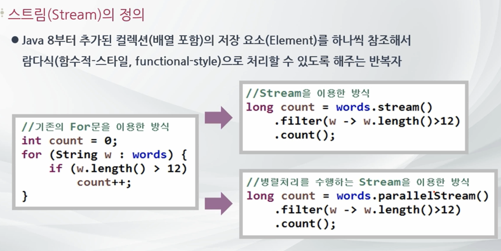
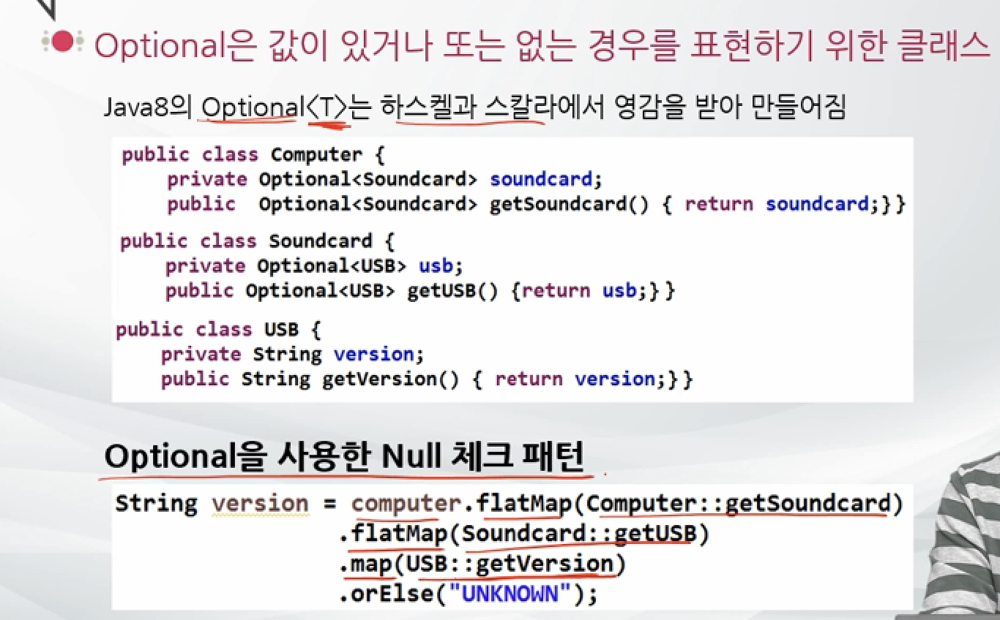
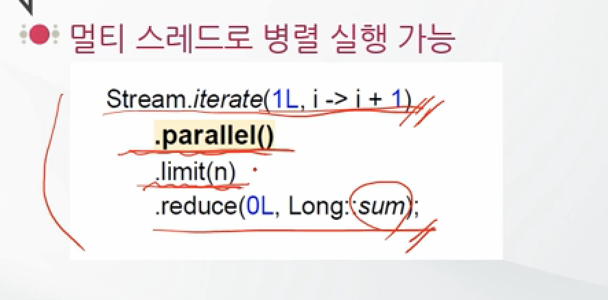

## Java

> 

# Stream


#### Stream 스트림




```java
long count = myList.stream()
  .filter(w -> w.length() > 3)
  .count();
System.out.println(count);

long count2 = myList.parallelStream()
  .filter(w -> w.length() > 3)
  .count();
System.out.println(count2);
```


pipline

- 여러개의 스트림이 연결되어 있는 구조


```java
long count3 = myList.stream()
        .map(w -> w.trim())
        .filter(w -> w.length() > 3)
        .count();
System.out.println(count3);
```


**Stream** 

내부반복 

최종 연산이 실행될 때 데이터가 계산됨

계산식을 JVM에 던진다.

Lazy loading

```java
numbers.forEach(n -> ... )
```


#### Stream 과 Optional

**filter연산(중간연산)**

Predicate를 인자로 받아서 true인 요소만을 반환

```java
menu.stream()
  .filter(Dish::isVergeterian)
  .collect(Collectors.toList());
```


**distinct연산(중간연산)**

유일한 값을 반환

```java
menu.stream()
  .distinct()
  .forEach(System.out::println);
```


**limit연산(중간연산)**

지정된 숫자만큼 반환

```java
menu.stream()
  .limit(3)
  .collect(Collectors.toList());
```


**map연산(중간연산)**

스트림의 T객체를 U로 변환. 파라미터로 Function<T, U>를 사용

```java
menu.stream()
  .map(Dish::getCalories)
  .reduce((prev, curr) -> prev+curr);
```


NullPointException에서 벗어나기 위해서 코드가 길어지고 보기 좋지 않아지는 경우가 있다. 그래서 **Optional** 을 사용



optional한 USB의 version을 리턴 하지만 null인 경우 UNKNOWN 리턴


**collect() (최종연산)**

Collectors.toList()

Collectors.toSet()


#### 입력/출력 스트림

데이터를 읽고 쓸 때는 스트림을 이용한다.


**Path** : 파일과 디렉터리를 나타낸다

디렉터리 이름을 나타내며, 경우에 따라 파일이름이 붙음

절대경로와 상대경로를 나타낼 수 있음

```java
Path absolute = Paths.get("/", "where", "to");
Path relative = Paths.get("myapp", "conf", "user.properties");
```


```java
import java.io.*;

public class TextFileTest {
    public TextFileTest() throws IOException {
    }

    public static void main(String[] args) throws IOException {
        // 텍스트 파일에서 파일 읽기
        try(BufferedReader in = new BufferedReader(
                new FileReader("test.txt"))) {
        String line;
        while ((line = in.readLine()) != null) {
            System.out.println(line);
        }}
        catch (FileNotFoundException fe) {
            System.out.println("FileNotFoundException 발생");
            }
//        in.close(); // 자원해지

        // 파일 쓰기
        try (BufferedWriter out = new BufferedWriter(
                new FileWriter("output.txt"))) {
            out.write("hello world");
        } catch (FileNotFoundException fe) {
        System.out.println("FileNotFoundException");
    	}
//        out.close();
    }
}
```


#### 병렬스트림



내부적으로 쪼개서 병렬처리됨


