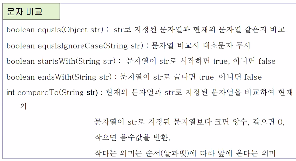
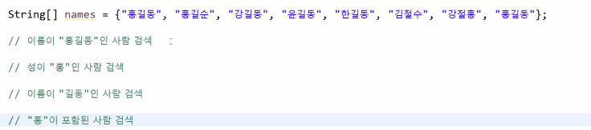
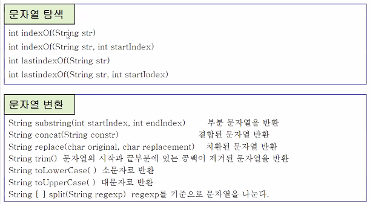

## Java

### CharAt(인수) / indexOf(문자) / substring(인수1, 인수2)  / length()


#### CharAt(인수)

* 문자열에서 인자로 주어진 값에 해당하는 문자를 리턴

* 인수번째의 문자를 읽어냄.

* 예 )

  > "abcde".charAt(2)에는 'c'가 읽어짐.


* ##### 문법

```java
charAt(index)
```

* index - 필수, 0보다 큰 정수

* 문자열에 속하는 문자는 왼쪽부터 오른쪽까지 0부터 인덱싱되어 있음.
* charAt은 index로 주어진 값에 해당하는 문자를 리턴.
* 인덱스는 0부터 시작하기 때문에 index로 들어갈 수 있는 가장 큰 수는 (문자열.length - 1).
* 존재하지 않는 index를 인자로 전달하면 공백이 출력.
* charAt은 index에 해당하는 문자를 리턴하고, chartCodeAt은 유니코드 값을 리턴하는 차이가 있음.


#### substring(인수1, 인수2)

* charAt은 문자하나를 읽어내지만 substring은 문자열을 읽어냄.
* 인수1은 시작지점 문자(반환값에 포함).
* 인수2는 끝지점에 다음문자(반환값에 포함하지 않음).

* 예 )

  > "abcde".substring(1, 3)은 "bc"를 읽어냄.


#### length()

* 인수의 길이를 나타냄.
* 예 )

```java
String str = "abcd";
int i = str.length();
System.out.println(i)
    
-------------------------
4
```


## 문자열 비교




```java
String str = new String("Hello"); 
String str2 = new String("Hello");
// new 하면 각각의 instance 객체를 만드는 것

// 서로의 주소가 다르다
System.out.println(str == str2); // false

String str3 = "Hello";
String str4 = "Hello";

// 서로의 주소가 다르다
System.out.println(str == str3); // false

// 주소가 같다
System.out.println(str3 == str4); // true

// 주소가 다르므로, 
// 주소비교하는 동등 아닌 equals() 를 사용해서 비교하는 것이 바람직하다. 
System.out.println(str.equals(str2)); // true

String str5 = "hello";

System.out.println(str4.equalsIgnoreCase(str5)); // true

System.out.println(str5.startsWith("h")); // true

System.out.println(str5.compareTo(str4)); // 32 
// 가장 먼저 발견한 차이를 바로 리턴한다.
// Hello와 hello는 달라서 사전수에 해당하는 그 차를 리턴한다.
// H와 h의 아스키 코드의 차이는 32이므로 이를 준다.

System.out.println(str4.compareTo(str5)); // -32
```


String1.`CompareTo`(String2)

| 값              | 조건                                                         |
| :-------------- | :----------------------------------------------------------- |
| 0보다 작습니다. | 이 인스턴스가 `value` 앞에 오는 경우                         |
| 0               | 이 인스턴스의 위치가 정렬 순서에서 `value`와 같은 경우       |
| 0보다 큽니다.   | 이 인스턴스가 `value` 다음에 오는 경우또는`value`은 `null`입니다. |




```java
for(String name: names) {

    if (name.contains("홍")) {
     	// "홍"이 포함된 사람 검색 
    }
    
}
```




**문자열 탐색**은 처음에 나온 것만 검색한다. 때문에 **두번째 인자에 시작 위치를 넣는게 가능하다.**


#### indexOf(문자)

* 해당 문자가 들어있는 위치를 알려줌.

* 문자가 없으면 `-1` 반환

* 예 )

  > "abcde".indexOf("e")에는 4가 읽어짐.

* lastIndexOf는 뒤에서부터 셈.


```java
String str = "hello world";
String searchStr = "l";

System.out.println(str+"에서"+searchStr+" 위치");
int searchIdx = str.indexOf(searchStr);

while(searchIdx != -1) {
    System.out.println("검색된 위치:" + searchIdx); // 2
    searchIdx = str.indexOf(searchStr,searchIdx+1);
}


System.out.println(str+"에서"+searchStr+"위치");
searchIdx = -1;
// 이 값이 -1이 아닌 경우 loop를 돌라는 뜻이다.
while ((searchIdx = str.indexOf(searchStr, searchIdx+1)) != -1) {
    System.out.println("검색된 위치:" + searchIdx); // 2
}
/*
hello world에서 l위치
검색된 위치:2
검색된 위치:3
검색된 위치:9
*/
```


**concat()**

```java
String A = "AAA";
String B = "BBB";
String AB = A+B;
System.out.println(AB); // AAABBB

String ABConcat = A.concat(B);
System.out.println(ABConcat); // AAABBB
```


**trim()** 

양쪽의 공백만 없애준다.

```java
str = "홍길동전:허균:조선시대";
String[] strA = str.split(":");
System.out.println(Arrays.toString(strA));
// [홍길동전, 허균, 조선시대]
```

