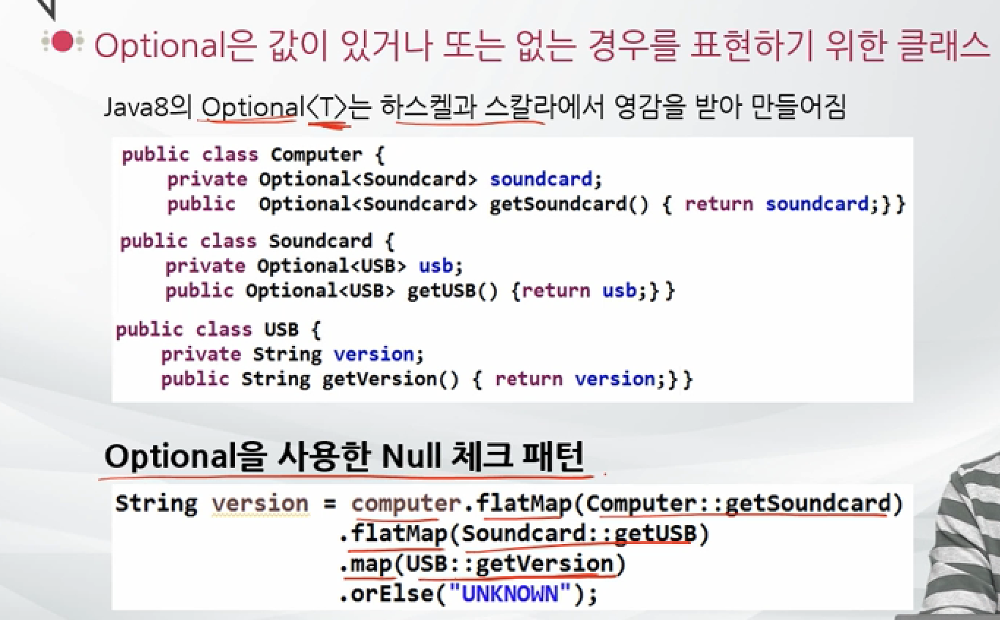

## Java

> 

# Stream

> 컬렉션(배열 포함)의 저장 요소를 하나씩 참조해서 람다식(함수적-스타일)로 처리할 수 있도록 해주는 반복자이다.


## 반복자 스트림

*Stream 생성*

```java
List<String> list = new ArrayList<>();
list.add("A");
list.add("B");

Stream<String> stringStream = list.stream();
stringStream.forEach(s -> System.out.println(s));
```


forEach() 메소드는 Consumer 함수적 인터페이스 타입의 매개값을 가지므로 컬렉션의 요소를 소비할 코드를 람다식으로 기술할 수 있다.

```java
void forEach(Consumer<T> action)
```


## 스트림의 특징

람다식으로 요소 처리 코드를 제공

내부 반복자를 사용하므로 병렬처리가 쉽다

중간 처리와 최종 처리 작업을 수행


***람다식으로 요소 처리 코드를 제공***

*Student.java*

```java
public class Student {

    private String name;
    private int age;
    public Student(String name, int age) {
        this.name = name;
        this.age = age;
    }

    public String getName() {
        return name;
    }

    public int getAge() {
        return age;
    }
}
```

*LambdaExpressionExample.java*

```java
public class LambdaExpressionExample {
    public static void main(String[] args) {
        List<Student> list = new ArrayList<>();
        list.add(new Student("A", 11));
        list.add(new Student("B", 12));

        Stream<Student> studentStream = list.stream();
        studentStream.forEach(myStudent ->
        {
            String name = myStudent.getName();
            int age = myStudent.getAge();
            System.out.println(name +"모씨는 "+ age+"살입니다.");
        });
    }
}

/*
A모씨는 11살입니다.
B모씨는 12살입니다.
*/
```


***내부 반복자를 사용하므로 병렬처리가 쉽다***

> 외부 반복자(external iterator)

개발자가 코드로 직접 컬렉션의 요소를 반복해서 가져오는 코드 패턴

`index`를 이용하는 for문 그리고 `Iterator`를 이용하는 while문 모두 외부 반복자를 이용하는 것이다.


> 내부 반복자(internal iterator)

컬렉션 내부에서 요소들을 반복시키고, 개발자는 요소당 처리해야할 코드만 제공하는 코드 패턴

*개발자는 반복에 대한 관리를 따로 하지 않아도 된다. 그래서 개발자는 요소 커리 코드에만 집중할 수 있다.

*요소들의 반복 순서를 변경*하거나, *멀티코어 CPU를 최대한 활용하기 위해 요소들을 분배시켜 병렬 작업*을 할 수 있게 도와주기 때문에 **하나씩 처리하는 순차적 외부 반복자 보다는 효율적으로 요소를 반복시킬 수 있다.**


> 병렬(Parellel) 처리

한가지 작업을 서브 작업으로 나누고, 서브 작업들을 분리된 스레드에서 병렬적으로 처리하는 것

```java
List<Student> list = new ArrayList<>();
list.add(new Student("A", 11));
list.add(new Student("B", 12));

Stream<Student> studentParallelStream = list.parallelStream();
studentParallelStream.forEach(myPerson -> {
    System.out.println(myPerson.getName() + ' ' +Thread.currentThread().getName());
});


// 첫번째 시도
/*
A ForkJoinPool.commonPool-worker-1
B main
*/

// 두번째 시도
/*
A ForkJoinPool.commonPool-worker-1
B main
*/
```

*병렬 처리를 확인할 수 있다.


***중간 처리와 최종 처리 작업을 수행***

스트림은 컬렉션의 요소에 대해 중간 처리와 최종 처리를 할 수 있다.

중간 처리에서는 *매핑, 필터링, 정렬*을 수행하고,

최종 처리에서는 *반복, 카운팅, 평균, 총합* 등의 집계 처리를 수행한다.

```java
double avg = list.stream()
  			// 중간처리 (학생 객체를 점수로 매핑)
        .mapToInt(Student::getAge)
  			// 최종처리 (평균 점수)
        .average()
        .getAsDouble();
```

*매핑(mapping): 중간 처리 기능으로 스트림의 요소를 다른 요소로 **대체**하는 작업


## 스트림의 종류

`Stream` - *객체* 요소를 처리하는 스트림

`IntStream`, `LongStream`, `DoubleStream` - *기본* 타입인 int, long, double 요소를 처리하는 스트림 

| 리턴 타입                           | 메소드(매개변수)                                             | 소스                                                         |
| ----------------------------------- | ------------------------------------------------------------ | ------------------------------------------------------------ |
| Stream<T>                           | java.util.Collection.stream()                                | 컬렉션                                                       |
| Stream<T>                           | java.util.Collection.parallelStream()                        | 컬렉션                                                       |
| Stream<T>                           | Arrays.stream(T[])  Stream.of(T[])                           | 배열                                                         |
| IntStream                           | Arrays.stream(int[])  IntStream.of(int[])                    | 배열                                                         |
| LongStream                          | Arrays.stream(long[]) LongStream.of(Long[])                  | 배열                                                         |
| DoubleStream                        | Arrays.stream(double[]) DoubleStream.of(double[])            | 배열                                                         |
| IntStream                           | IntStream.range(int, int), IntStream.rangeClosed(int, int)   | Int 범위 - rangeClosed() 메소드는 두번째 파라미터인 끝값을 포함. range()는 포함하지 않는다. |
| LongStream                          | LongStream.range(long, long), LongStream.rangeClosed(long, long) | long 범위 - rangeClosed() 메소드는 두번째 파라미터인 끝값을 포함. range()는 포함하지 않는다. |
| Stream<Path>                        | Files.find(Path, int, BiPredicate, FileVisitOption), Files.list(Path) | 디렉토리 - Path 경로에서 BiPredicate가 true인 Path Stream을 얻을 수 있다. |
| Stream<String>                      | Files.lines(Path, Charset), BufferedReader.lines()           | 파일 - 한 라인에 대한 텍스트 정보를 요소가지는 Stream을 얻을 수 있다. |
| DoubleStream, IntStream, LongStream | Random.doubles(…), Random.ints(), Random.longs()             | 랜덤수                                                       |


## 컬렉션으로부터 스트림 얻기


## 배열로부터 스트림 얻기


## 숫자 범위로부터 스트림 얻기


## 파일로부터 스트림 얻기


**Path** : 파일과 디렉터리를 나타낸다

디렉터리 이름을 나타내며, 경우에 따라 파일이름이 붙음

절대경로와 상대경로를 나타낼 수 있음

```java
Path absolute = Paths.get("/", "where", "to");
Path relative = Paths.get("myapp", "conf", "user.properties");
```


```java
import java.io.*;

public class TextFileTest {
    public TextFileTest() throws IOException {
    }

    public static void main(String[] args) throws IOException {
        // 텍스트 파일에서 파일 읽기
        try(BufferedReader in = new BufferedReader(
                new FileReader("test.txt"))) {
        String line;
        while ((line = in.readLine()) != null) {
            System.out.println(line);
        }}
        catch (FileNotFoundException fe) {
            System.out.println("FileNotFoundException 발생");
            }
//        in.close(); // 자원해지

        // 파일 쓰기
        try (BufferedWriter out = new BufferedWriter(
                new FileWriter("output.txt"))) {
            out.write("hello world");
        } catch (FileNotFoundException fe) {
        System.out.println("FileNotFoundException");
    	}
//        out.close();
    }
}
```


## 디렉토리로부터 스트림 얻기


## 중간 처리와 최종 처리

스트림은 데이터의 `필터링`, `매핑`, `정렬`, `그룹핑` 등의 **중간 처리**와 `합계`, `평균`, `카운팅`, `최대값`, `최소값` 들의 **최종 처리**를 파이프라인으로 해결한다.

```java
long count3 = myList.stream()
        .map(w -> w.trim())
        .filter(w -> w.length() > 3)
        .count();
System.out.println(count3);
```

```java
long count = myList.stream()
  .filter(w -> w.length() > 3)
  .count();
System.out.println(count);

long count2 = myList.parallelStream()
  .filter(w -> w.length() > 3)
  .count();
System.out.println(count2);
```

 

## 중간 처리 메소드와 최종 처리 메소드


**filter연산(중간연산)**

Predicate를 인자로 받아서 true인 요소만을 반환

```java
menu.stream()
  .filter(Dish::isVergeterian)
  .collect(Collectors.toList());
```


**distinct연산(중간연산)**

유일한 값을 반환

```java
menu.stream()
  .distinct()
  .forEach(System.out::println);
```


**limit연산(중간연산)**

지정된 숫자만큼 반환

```java
menu.stream()
  .limit(3)
  .collect(Collectors.toList());
```


**map연산(중간연산)**

스트림의 T객체를 U로 변환. 파라미터로 Function<T, U>를 사용

```java
menu.stream()
  .map(Dish::getCalories)
  .reduce((prev, curr) -> prev+curr);
```


NullPointException에서 벗어나기 위해서 코드가 길어지고 보기 좋지 않아지는 경우가 있다. 그래서 **Optional** 을 사용



optional한 USB의 version을 리턴 하지만 null인 경우 UNKNOWN 리턴


**collect() (최종연산)**

Collectors.toList()

Collectors.toSet()


## Optional 클래스

단순히 집계 값만 저장하는 것이 아니라, 집계 값이 존재하지 않을 경우 디폴트 값을 설정할 수 있고, 집계값을 처리하는 consumer도 등록할 수 있다.


