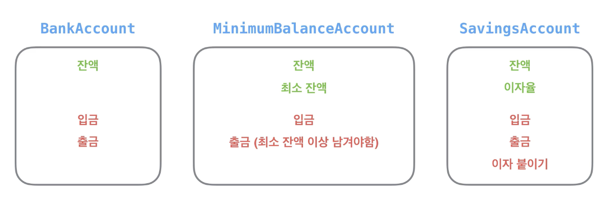
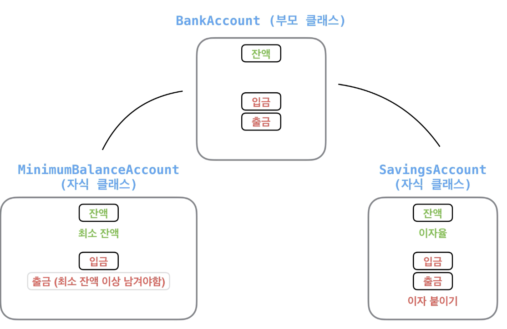
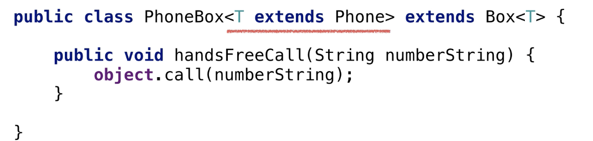

[TOC]

# 참고

[생활코딩 자료정리](http://tcpschool.com/java/java_collectionFramework_stackQueue)


# 자바

**"한 번만 작성하면, 어디서든 동작한다. (Write Once, Run Anywhere.)"**


'`자바 가상머신`'이라는 것만 설치되면, 어느 운영체제이든, 어느 디바이스이든, 동일하게 동작합니다. (자바 가상머신, Java Virtual Machine,  **JVM**)

**JRE** (Java Runtime Environment) JVM을 사용해서 마음껏 개발할 수 있는 환경

내 컴퓨터에 이런 환경을 만들기 위해서는 **JDK** (Java Development Kit) 라는 것을 설치

**객체 지향 프로그래밍 (Object Oriented Programming, OOP)**은 프로그램을 작성하는 기법

- 부품에 해당하는 객체 (Object)를 먼저 만들고, 이것들을 하나씩 조립 및 연결해서 전체 프로그램을 완성하는 기법


`Java project` 생성 -> `Class` 생성 순

Class의 변수명은 항상 대문자로 시작


Eclipse 삽질했다.

Package명을 꼭 작성하고 시작할 것.


- `ArithmeticException` 산술/연산예외

```java
		try {
			int z = 10%0;
			System.out.println(z);
		} catch (ArithmeticException e) {
			System.out.println("0으로 나눌 수 없다.");
		}
```

그렇다고 해서 실수 타입인 0.0 또는 0.0f로 나누면 `ArithmeticException`이 발생하는 것이 아니라 `Infinity`(/ 경우)와 `NaN`(% 경우)이 산출되어 데이터가 엉망이 된다.

```java
		double x = 0.0;
		int a = 10;
		double z = a % x;
		if (Double.isInfinite(z) || Double.isNaN(z)) {
			System.out.println("값 산출 불가.");
		} else {
			System.out.println(z);
		}
```


- Str1.`equals(str2)`

원본 문자열과 매개 값으로 주어진 비교 문자열이 동일한지 비교한 후 true 또는 false를 리턴한다. (즉, 객체가 참조하고 있는 주소값과는 상관없이 변수가 담고있는 값만을 비교한다.)


- `sout` == System.out.println()


- 표현할 수 있는 범위에 따라 정해짐
  - 뒤로갈 수록 표현할 수 있는 범위가 작다

`double` - `float` - `long` - `int` - `short` - `byte`


```java
int i = 10;
if (i % 3 == 0) { // i < 20 : 불린 식, 변수, 메소드
    System.out.println("C 구역입니다.");
} else if (1 % 3 == 1) {
    System.out.println("A 구역입니다.");
} else {
    System.out.println("B 구역입니다.");
}

switch (i % 3) { // i : 불린이 아닌 식, 변수, 메소드
    case 0:
        System.out.println("C 구역입니다.");
        break;
    case 1:
        System.out.println("A 구역입니다.");
        break;
    default:
        System.out.println("B 구역입니다.");
        break;
}
```


- `.toCharArray`()

```java
// 스트링을 배열로 만든다.
char[] charArray = dna.toCharArray();
```


- 객체지향프로그래밍 **OOP** Object Oriented Programming

정보와 동작들을 객체 단위로 묶고, 이런 객체들을 연결시키면서 정리하는 프로그래밍 방식

**'객체'**는 '속성'들과 '동작'들의 묶음이라고 할 수 있는데요. 속성은 **'변수'**로 나타내고, 동작은 **'메소드(함수)'**로 나타냅니다.


- 클래스란

  객체의 설계도

  - Property

  - Method
    - 클래스에 있는 함수

- 인스턴스

  - 클래스를 기반으로 만들어진 객체
  - Song - 걱정말아요 그대, 거위의 꿈
  - Person - 김신의, 문종모, 성태호

  

- 기본형 **Primitive Type** VS 참조형 **Reference Type**
  - 기본형 **Primitive Type**

    - Int, boolean, char, double
    - 변수가 그 값을 직접적으로 보관

  - 참조형 **Reference Type** // 배열을 포함한 객체

    - Person, String, int[]
    - 실제 값은 메모리에 저장, 변수는 그 영역을 가르킨다.

    - null은 참조형 변수만 가질 수 있는 값이다.

      - `null`을 보관하고 있는 변수의 메소드를 호출하려고 하면 `NullPointerException`이라는 오류가 난다.

      ```java
      Person[] people = new Person[5];
      people[0] = new Person("김신의", 28);
      people[2] = new Person("문종모", 26);
      people[3] = new Person("서혜린", 21);
      
      for (int i = 0; i < people.length; i++) {
          Person p = people[i];
          if (p != null) {
              System.out.println(p.getName());
          } else {
              System.out.println(i + "번 자리는 비었습니다.");
          }
      }
      ```

- Short-Circuit Evaluation 

  - And 연산 &&

    ```java
    boolean newBoolean = m1() && m2() && m3();
    ```

    `newBoolean`이 `true`가 되기 위해서는 `m1()`, `m2()`, `m3()`가 모두 `true`를 리턴

    따라서 `m1()`이 `false`를 리턴하면 `m2()`와 `m3()`의 결과와 상관 없이 `newBoolean`은 `false`

    실제로 자바는 효율성을 위해서 `m1()`이 `false`를 리턴하면 `m2()`와 `m3()`를 실행하지 않는다. 

    이렇게 식의 결과값이 이미 결정된 경우 미리 멈추는 것을 **'숏서킷 연산(Short-circuit evaluation)'**.

    

  - Or 연산 ||

    ```java
    boolean newBoolean = m1() || m2() || m3();
    ```

    `newBoolean`이 `false`이기 위해서는 `m1()`, `m2()`, `m3()`의 리턴값이 모두 `false`이어야한다. 

    따라서 `m1()`이 `true`를 리턴하면 `m2()`와 `m3()`는 실행되지 않고 `newBoolean`은 `true`가 된다.


- 기본형 참조형
  - 2
  - 4
  - [person, null] [26, 0]. 1
  - [27,0] [person, person] [28,0] 3


-  `"".isEmpty()`의 결과값은 `true`이고 `"abc".isEmpty()`의 결과값은 `false`

- null 퀴즈

  - 3

  - `s`는 `null`이기 때문에, `if`문의 첫 번째 조건`s != null`의 값은 `false`입니다.
  
    앞쪽 메소드가 `false`를 리턴하면 뒤쪽 메소드도 실행됩니다. 그런데 `s`가 `null`인 상황에서 `s.isEmpty()`는 `NullPointerException` 에러
    
  - - ```java
    String s = null;
      // s.isEmpty() => true 
      // => !true -> false
      if (s != null || !s.isEmpty()) {
          System.out.println("Answer A");
      } else {
          System.out.println("Answer B");
      }	
      ```
      

  -  
  
    - 2
  
    - if문의 첫 번째 조건부터 봅시다. `str != null`은 원소가 `null`인지 체크하는 조건
  
    -  `null`이 아니라면 `true`를 리턴
  
      두 번째 조건`!str.isEmpty()`은 문자열 `str`이 빈 문자열인지 확인합니다. `strings[2].isEmpty()`의 경우 `true`를 리턴하겠죠.
  
      그런데, 두 조건이 and 연산(`&&`)으로 연결
  
      숏서킷 연산에 의해 첫 번째 조건이 `true`인 경우, 즉 `str`이 `null`이 아닌 경우에만 두 번째 조건을 수행
    
    그렇기 때문에 앞 문제에서처럼 `NullPointerException`은 발생하지 않는다.
    
    자, 두 조건문을 연결해서 생각해보면, 이 if문은:
    
      1. `str`이 `null`이 아니면서 빈 문자열도 아닐 경우 `countA`를 하나 증가
      2. `str`이 `null`이거나 빈 문자열(`""`)인 경우 `countB`를 하나 증가
    
      그러므로 `null`인 `strings[1]`, `strings[3]`의 경우, 그리고 빈 문자열인 `strings[2]`의 경우 `countB`가 증가 되어, 최종적으로 `3`이 출력


```java
String[] strings = new String[5];
// [null, null, null, null, null]

strings[0] = "Hello";
strings[2] = "";
strings[4] = "Java";
// ["Hello", null, "", null, "Java"]

// 2, 3
int countA = 0, countB = 0;
for (String str : strings) {
    if (str != null && !str.isEmpty()) {
        countA++;
    } else {
        countB++;
    }
}
System.out.println(countB);
```


- `final` // 변수 안전하게 만들기
  - 변수를 정의할 때 `final`을 써주면, 그 변수는 '상수'가 된다. 즉, 한 번 정의하고 나서 다시 바꿀 수 없다는 것

```java
final double pi = 3.141592;
pi = 2.54; // java: cannot assign a value to final variable name
```


- 코드안전하게 만들기 try-catch 예외처리

  - ```java
    try {
      // 오류를 발생시킬 수 있는 코드
    } catch (Exception e) {
      // 오류가 발생한 경우 해결
      System.out.println(e.getMessage());
    }
    ```
    
  - ```java
    int[] smallArray = new int[3];
    
    for (int i=0; i <10; i++) {
      try {
        smallArray[i] = i;
      } catch (ArrayIndexOutOfBoundsException e) {
        System.out.println(e.getMessage());
      }
    }
    
    // 결과확인
    for (int i:smallArray) {
      System.out.println(i);
    }
    ```
  
  - 예외처리를 하여 프로그램이 죽지않고 예외부분은 메세지로, 그리고 그 외에 처리된 부분은 정상적으로 처리된 것을 확인 할 수 있다.


- 인스턴스 변수 vs 클래스 변수

  - 인스턴스 변수 버전

    - ```java
      public class Person {
          int count;
      }
      ```

    - Person 클래스에 count라는 인스턴스 변수가 있다. 해당 변수는 총 몇개의 Person 인스턴스가 있는지 보관한다.

    - ```java
      public static void main(String[] args) {
          Person p1 = new Person();
          p1.count++; 
      
          Person p2 = new Person();
          p1.count++;
          p2.count = p1.count;
      
          Person p3 = new Person();
          p1.count++;
          p2.count++;
          p3.count = p2.count;
      
          Person p4 = new Person();
          p1.count++;
          p2.count++;
          p3.count++;
          p4.count = p3.count;
      
          System.out.println(p1.count); // 4
          System.out.println(p2.count); // 4
          System.out.println(p3.count); // 4
          System.out.println(p4.count); // 4 
      ```

    - 이 경우 새로운 Person 인스턴스를 생성할때마다 각 count 변수를 바꿔줘야 올바른 값이 나온다.

  - 클래스 변수 버전

    - 클래스 변수를 정의하기 위해 `static`이라는 키워드를 붙여준다.

    - ```java
      public class Person {
          static int count;
      }
      ```

    - 이렇게 `static`으로 해두면 count는 특정 인스턴스에만 해당되는 것이 아니라 Person 클래스 전체에 해당된다. 따라서 count를 부를때는 `클래스이름.count`로 부른다.


```java
public static void main(String[] args) {
    Person p1 = new Person();
    Person.count++;

    Person p2 = new Person();
    Person.count++;

    Person p3 = new Person();
    Person.count++;

    Person p4 = new Person();
    Person.count++;

    System.out.println(Person.count); // 4
}
```

- 하지만, Person.count를 매번 선언해줘여 한다는 단점, 그래서 생성을 할때 내부적으로 	count가 가능하게 하면 더욱 깔끔한 코드를 작성할 수 있다.

  - ```java
    public class Person {
        static int count;
    
        public Person() {
            count++;
        }
    }
    ```

  - ```java
    public static void main(String[] args) {
        Person p1 = new Person();
        Person p2 = new Person();
        Person p3 = new Person();
        Person p4 = new Person();
    
        System.out.println(Person.count);
    }
    ```


- 상수
  - 좀 더 상수를 상수답게 사용하기
    - public `static` `final` double PI = 3.141592653589793;
    - static과 final를 함께 써야한다. 왜냐하면 상수는 인스턴트에만 해당하는 것이 아니고 여러 복사본 대신 한 값만 저장해두는 것이 맞기 때문이다.
    - 상수이름은 보통 `대문자`로 작성, 단어가 여러개인 경우`_`로 구분 짓는다.


- 클래스 메소드

  - `클래스 변수`는 `클래스에 속한 변수`

  - `클래스 메소드`는 `클래스에 속한 메소드`

    - 인스턴스 메소드는 인스턴스에 속해있어서 인스턴스를 반드시 생성해야 사용할 수 있지만, 클래스 메소드는 클래스에 속한 것이므로 인스턴스를 생성하지 않고 사용할 수 있다.

    ```java
    import java.lang.Math;
    
    public class Driver {
        public static void main(String[] args) {
            System.out.println(Math.abs(-10));   // 절댓값
            System.out.println(Math.max(3, 7));  // 두 값 중 최댓값
            System.out.println(Math.random());   // 0.0과 1.0 사이의 랜덤값
        }
    }
    ```

    Math 클래스에서 바로 메소드를 사용하는 경우를 확인할 수 있다.

```java
public class Counter {
    static int count;

    public static void increment() {
        count++;
    }

    public static void main(String[] args) {
        System.out.println(Counter.count); // 0

        Counter.increment();
        System.out.println(Counter.count); // 1

        Counter.increment();
        System.out.println(Counter.count); // 2

        Counter.increment();
        System.out.println(Counter.count); // 3
    }
}
```


- String 클래스

  - ```java
    String myString = "aBc";
    System.out.println(myString.toUpperCase()) // 모두 대문자로
    System.out.println(myString.toLowerCase()) // 모두 소문자로
    System.out.println(myString)               // 그대로
    ```

```java
String myString = "aBc";
System.out.println(myString.toLowerCase() == "abc");
// false
```

```java
String myString = "aBc";
System.out.println(myString.toLowerCase().equals("abc"));
// true
```


- Math 클래스

```java
import java.lang.Math;

public class Driver {
    public static void main(String[] args) {
        System.out.println(Math.abs(-10)); // 10
        System.out.println(Math.abs(8)); // 8
      
        System.out.println(Math.min(4, 10));  // 최솟값 4
        System.out.println(Math.max(4, 10));  // 최댓값 10
    }
}
```


- Random 클래스

```java
import java.util.Random;

public class Driver {
    public static void main(String[] args) {
        Random rand = new Random();
        System.out.println(rand.nextInt(10));   // 0 이상 9 이하의 랜덤한 값
      
      	// Random rand = new Random();
        int min = 10;
        int max = 30;

        System.out.println(rand.nextInt((max - min) + 1) + min);   // 10 이상 30 이하의 랜덤한 값
    }
}
```


- Wrapper 클래스
  - 기본 자료형을 객체 형식으로 감싸는 역할
    
    - `Integer` 클래스는 `int`형을, `Double` 클래스는 `double`을, `Long` 클래스는 `long`을, `Boolean` 클래스는 `boolean`을 감싸는 것
    
  - 이러한 Wrapper 클래스가 필요한 이유는 기본형 자료형을 참조형처럼 다뤄야 할 경우가 있을때다.
  
  - ```java
    Integer i = new Integer(123);
    Integer i = 123;
    ```

```java
System.out.println(123 == 123);
System.out.println(new Integer(123) == new Integer(123));
// true
// false
```

```java
System.out.println(new Integer(123).equals(new Integer(123)));
// true
```


- HashMap

```java
import java.util.ArrayList;
import java.util.HashMap;

public class HashMapPrac {
    public static void main(String[] args) {
        ArrayList<String> arrayList = new ArrayList<>();
        arrayList.add("이상해");

        // HashMap
        // Key -> Value

        HashMap<String, String> pokedex = new HashMap<String, String>();
        pokedex.put("피카츄","피카츄");
        pokedex.put("라이츄", "라이츄");

        pokedex.remove("이상해풀");

        // 찾고자 하는 value에 해당하는 key를 파라미터로 넘겨준다.
        String poke003 = pokedex.get("이상해꽃");

        // 같은 key에 여러 value를 저장하면 가장 마지막에 저장된 value로 덮어씌워진다.
        pokedex.put("피카츄", "피카츄3");

        for (String key:pokedex.keySet()) {
            System.out.println(key + pokedex);
        }

    }
}
```

- HashMap의 key는 'hashcode'라는 것으로 관리된다.
  - 이 `hashcode`는 모든 클래스의 인스턴스가 가진 고유한 값인데, 인스턴스마다 다르기 때문에 HashMap이 key를 구분하는 값으로 사용된다.
  - 여러 인스턴스가 같은 hashcode를 가질 수 있으며, 이 경우 HashMap에선 key.equals(anotherKey)메소드로 구분
  - 그런데 `String`은 서로 다른 인스턴스라도 안의 내용이 같으면 같은 hashcode를 갖는다. 그렇기 때문에 `HashMap`의 key로서 `String`이 매우 적합 
  - Key는 실제 인스턴스보다는 안에 담긴 의미, 내용으로 구분하는 것이 좋기 때문


- 상속 `extends`
  - 잔액이라는 속성과 입금기능은 셋다 가지고 있음
  - 출금 또한. 하지만 하나는 다르다.




- MinimumBalanceAccount와 SavingsAccount가 BankAccount를 상속
  - 상속받으면 중복된 코드를 상속받으므로 코드가 중복적으로 적힐 필요 없다.
  - MinimumBalanceAccount -> 출금을 `@Override`
    - `@Override`와 같이 골뱅이(`@`)가 붙어있는 문법을 '어노테이션(Annotation)'. 주석(Comment)과 어느정도 비슷하지만, 어노테이션은 자바에서 추가적인 기능을 제공
    - `@Override`를 써줬는데 부모 클래스에 같은 이름의 메소드가 없는 경우, 오류




```java
public class BankAccount {
    private int balance;

    public int getBalance() { 
        return balance; 
    }

    public void setBalance(int balance) {
        this.balance = balance;
    }

    // 출금
    public boolean withdraw(int amount) {
        if (balance >= amount) {
            balance -= amount;
            return true;
        }

        return false
    }

    // 입금
    public boolean deposit(int amount) {
        balance += amount;
        return true;
    }
}
```


```java
public class SavingsAccount extends BankAccount {
    private double interest;

    public void setInterest(double interest) {
        this.interest = interest;
    }

    public double getInterest() {
        return interest;
    }

    public void addInterest() {
      // balance는 부모클래스에서 private이므로 부모의 method로 접근해야한다.
        setBalance((int) (getBalance() * (1 + interest)));
    }
}
```


```java
public class MinimumBalanceAccount extends BankAccount {
    private int minimum;

    public void setMinimum(int minimum) {
        this.minimum = minimum;
    }

    public int getMinimum() {
        return minimum;
    }

  	// MinimumBalanceAccount의 인스턴스는 BankAccount의 withdraw가 아닌 MinimumBalanceAccount의 withdraw를 호출
    @Override
    public boolean withdraw(int amount) {
        if (getBalance() - amount < minimum) {
            System.out.println("적어도 " + minimum + "원은 남겨야 합니다.");
            return false;
        }

        setBalance(getBalance() - amount);
        return true;
    }
}
```


- super

  - 상속을 받은 자식키워드가 사용

    - 자식클래스가 1. 부모클래스의 변수, 메소드를 사용할 때 2. 부모클래스의 생성자를 사용할 때

  - super(변수)  super.메소드()

  -  **(1)** 자식클래스의 인스턴스 생성시 부모클래스의 생성자는 반드시 불린다. 인스턴스 생성시 생성자 호출은 필수

    - ```java
      Child c = new Child(); // Child 인스턴스 생성시 Parent의 생성자도 불림
      ```

    - 부모에서 this.balance 자식에서 super(balance)

  -  **(2)** 부모클래스의 생성자가 없는 경우에 부모클래스의 기본 생성자가 불린다. **즉, 파라미터가 없는 생성자가 없는 경우, 자식 클래스에서 반드시 직접 (코드로 써서) 부모 클래스의 생성자 호출을 시켜줘야한다.**

    - 부모에서 ...  , 자식에서 this.balance 

    - ```java
      public class Parent {
          // 별도로 생성자가 지정되어있는 경우 (파라미터 없는 기본 생성자가 없는 경우)
          public Parent(int a, int b) {
              ...
          }
          ...
      }
          
      public class Child extends Parent {
          public Child() {
              super(0, 0); // 자식 클래스에 생성자를 만들어 'super(int, int)'를 호출해 주어야 함
              ...
          }
      }
      ```

  - 부모클래스에 기본 생성자가 없는 경우 자식 클래스에 생성자를 만들어 부모클래스의 생성자를 호출해야한다.

    - 부모클래스의 생성자 호출은 맨 윗줄에 적어야 한다.

    - 오류 

      ```java
      public class Child extends Parent {
          public Child() {
              int a = 0;
              ...
              super(0, 0); // 이 곳에서 호출할 수 없음. 반드시 첫 번째 줄에 있어야 함.
          }
      }
      ```


- 부모의 변수, 메소드를 사용할때

```java
public class BankAccount {
    .
    .
    .
    boolean withdraw(int amount) {
        ...
    }
}

public class TransferLimitAccount extends BankAccount {
    private int transferLimit;

    @Override
    boolean withdraw(int amount) { // 정의한 메소드 사용
        if (amount > transferLimit) {
            return false;
        }

        return super.withdraw(amount); // 부모의 메소드 사용
    }
}
```


- 부모의 생성자를 사용할때

```java
public class BankAccount {
    ...
    public BankAccount(int balance) {
        this.balance = balance;
    }
}

public class TransferLimitAccount extends BankAccount {
    ...
    public TransferLimitAccount(int balance, int transferLimit) {
        super(balance); // 부모클래스의 생성자를 부르는 키워드
        this.transferLimit = transferLimit;
    }
}
```


```java
public class A {
    public A() {
        System.out.println("1");
    }

    public void a() {
        System.out.println("2");
    }
}

public class B extends A {
    // empty class!
}
B b = new B(); // 1
b.a(); // 2


public class C extends A {
		@Override
  	public void a() {
        System.out.println("3");
    }
}
C c = new C(); // 1
c.a()// 3
  
  
public class D extends C {
  	@Override
    public void a() {
        System.out.println("4");
        super.a(); // 직전의 부모클래스
    }
}
D d = new D(); // 1 
d.a(); // 4 // 3


public class E extends A {

    public E() {
        System.out.println("5");
    }

    public E(int a) {
        System.out.println("6");
    }
}
E e = new E(1); // 1 // 6
e.a(); // 2


public class H extends E {
    public H(int a) {
        System.out.println("10");
    }
}
H h = new H(1); // 1 // 5 // 10 
h.a(); // 2
```


```java
public class F {
  // 부모인 F클래스에 기본 생성자가 없어서 자식 클래스는 어떤 생성자를 호출할지 모른다.
  // 자식에서 super(1)과 같이 명확하게 호출해줘야 한다.
    public F(int a) {
        System.out.println("7");
    }
    
    public void a() {
        System.out.println("8");
    }
}
public class G extends F {
    public void a() {
        super.a();
        System.out.println("9");
    }
}

G g = new G(); // 오류발생
g.a();
```


```java
public class I extends A {
    public I() {
        System.out.println("11");
        super(); // 부모클래스의 생성자 호출은 자식 클래스 생성자의 맨 첫 줄에서 불려야 한다.
    }
}
I i = new I(); // 오류발생
i.a();
```


- protected 접근 제어자

```java
public class BankAccount {
    private int balance;
    ...
}
public class MinimumBalanceAccount extends BankAccount {
    ...
    @Override
    public boolean withdraw(int amount) {
      // private로 되어있어서 balance에 접근하기 위해서는 부모클래스의 메소드로 get해야 했다. 보호 차원에서는 좋지만, 상속한 클래스에서의 접근성 마저 떨어지게 되어 유연하지 않다고 볼 수 있다.
        if (getBalance() - amount < minimum) {
            System.out.println("적어도 " + minimum + "원은 남겨야 합니다.");
            return false;
        }
    
        setBalance(getBalance() - amount);
        return true;
    }
}
```

이런경우 protected 사용 -> 자식 클래스에서 접근 가능하도록 한다.

상속의 유연함과 private의 보호성을 동시 만족


```java
public class BankAccount {
    protected int balance;
    ...
}
public class MinimumBalanceAccount extends BankAccount {
    ...
    @Override
    public boolean withdraw(int amount) {
        // if (getBalance() - amount < minimum) {
        if (balance - amount < minimum) {
            System.out.println("적어도 " + minimum + "원은 남겨야 합니다.");
            return false;
        }
    
        // setBalance(getBalance() - amount);
        balance -= amount;
        return true;
    }
}
```

상속받는 클래스에서만 접근 가능하나, BankDriver같은 외부 클래스에서 접근이 안되는 것은 여전히 유효하다.

그래서 상속받은 클래스에서 접근이 잦은 경우 protected로 선언하게 된다!


- 객체를 위한 클래스  Object Class

  - Object 최상위 클래스, 모든 클래스의 부모클래스

    ```java
    Object object = new Object();
    ```

  - person.toString()

    ```java
    @Override
    public String toString() {
      return firstName + lastName //이런식으로 재정의 해주면 글자로 잘 나온다.
    }
    ```

    

- 캐스팅 Casting

  - 다운캐스팅 

    ```java
    If (account instanceof SavingsAccount) {
    
    ((SavingsAccount) account).addInterest();
    
    }
    ```

  - 타입캐스팅

    - BankAccount 타입으로 캐스팅 되고 한 번에 묶어서 다룬다.

    ```java
    ArrayList<BankAccount> accounts = new ArrayList<>;
    
    accounts.add(ba);
    accounts.add(mba);
    accounts.add(sa);
    
    for (BankAccount account : accounts) {
        account.deposit(1000);
    }
    ```


- 제너릭 Generic

Generic은 Casting을 보완

```java
public class Box<T> {
    private T something;

    public void set(T object) { 
        this.something = object;
    }

    public T get() {
        return something;
    }
}

// 아래와 같이 String을 넘겨주면, 
Box<String> box = new Box<>();


public class Box<String> { // 이처럼 <T>가 <String>으로 동작한다.
    private String object;

    public void set(String object) {
        this.object = object;
    }

    public String get() {
        return object;
    }
}
```

아래 꺽쇠 기호(`<>`) 사이에 있는 `T`를 **'타입 파라미터**

`Box`와 같이 타입 파라미터를 받는 클래스를 **'제네릭 클래스(Generic Class)'**


`T`(Type)

`E`(Element)

만약 `HashMap`의 경우에는 `K`(Key)와 `V`(Value)


- 상속의 개념이 합쳐지면 더 다양한 방식으로 제네릭(generic)을 사용 가능




`PhoneBox` 클래스는 `Phone` 타입을 받는 `Box` 클래스를 상속

```java
public class PhoneBox extends Box<Phone> {
    public void handsFreeCall(String numberString) {
        object.call(numberString);
    }
}
```


개선

- `extends` 키워드를 이용하면 타입을 제한 가능
  - `AndroidPhone`이라는 클래스는 `Phone`을 상속 받기 때문에 `PhoneBox`은 가능, 하지만 `PhoneBox`을 쓰면 오류가 발생.

```java
// <T extends Phone>은 T가 Phone의 자식 클래스이어야 한다.
public class PhoneBox<T extends Phone> extends Box<T> {
    public void handsFreeCall(String numberString) {
        object.call(numberString);
    }
}
```


- 인터페이스

  - 계약서, 빈 메소드의 모음

  - public interface Shape { double getArea() }

    - public Circle implements Shape {

      // 사용하겠다고 선언했으면 사용해야 오류가 발생하지 않는다. 

      Public double getArea() {return PI * radius * radius}

      }

    - shape이라는 공통된 타입으로 묶어서 다룰 수 있다.
    
  - 


- 추상클래스 

  - 변수, 메소드, 빈메소드를 모두 가질 수 있다.

    ```java
    public abstract class Shape {
        
        private double x,y;
    
        public double getX() {
            return x;
        }
    
        public double getY() {
            return y;
        }
    
        public void move(double x, double y) {
            this.x += x;
            this.y += y;
        }
    
        public abstract double getArea();
        public abstract double getPerimeter();
    }
    ```

사전적 의미로의 추상을 생각해보면, 추상은 **실체 간에 공통되는 특성을 추출**한 것을 말한다.

새, 곤충, 물고기 등 실체에서 공통되는 특성은 '동물'이다. 

삼성, 현대 등 실체에서 공통되는 특성은 '회사'이다.

즉 객체를 직접 생성할 수 있는 클래스를 실체 클래스라고 하면, 이 클래스들의 공통적인 특성을 추출해서 선언한 클래스를 추상클래스라고 한다.

그래서 추상클래스가 실체클래스보다 상위/부모 클래스가 되어, 연관된 실체클래스는 추상클래스의 변수, 메소드, 빈메소드를 모두 `상속` 받을 수 있다.


추상 클래스의 용도는?

1. 실체 클래스들의 공통된 필드와 메소드의 이름을 통일할 목적

   예를들면, Telephone과 Smartphone을 각기 다른 개발자가 코드를 작성한다고 했을때, 사용자의 변수명을 user, owner 이런식으로 각기 다르게 적는 경우가 생기는데, 사실 Telephone과 Smartphone은 공통적으로 사용자를 가지고 있기 때문에, Phone이라는 추상클래스를 상속받아 owner든, user든 하나를 정해서 그것을 사용하면 일관성이 확보된다.

2. 실체 클래스를 작성할 때 시간을 절약

   공통된 부분을 상속받아 사용하므로 코드를 중복해서 적을 필요가 없어 시간이 절약된다.


- 익명클래스
  - 생성하면서 abstract method를 정의할 수 있다.
  - 사용자가 어떤 이름의 클래스를 만들지 모르는 경우, 사용 가능


- comparable 인터페이스 
  - Collections.sort(nameArrayList) // 작은순서대로
  - 안에 원소가 두 가지 이상이면 기준을 정해줘야 한다.
  - implements Comparable<Person> -> 선언후 메소드 생성


# 키워드


- Stack

```java
// HashMap<T> Character, String, Integer...
// 해시맵은 객체로 선언해주어야 한다.
private HashMap<Character, Character> mappings;


// 자바에서 메모이제이션을 만들려면, 해시맵.put(K, V) 식으로 추가해줘야 한다.
public Solution() {
  this.mappings = new HashMap<Character, Character>();
  this.mappings.put(')', '(');
  this.mappings.put('}', '{');
  this.mappings.put(']', '[');
}


// stack 라이브러리
// .pop(Index)
// 해당 스택의 제일 상단에 있는(제일 마지막으로 저장된) 요소를 반환하고, 해당 요소를 스택에서 제거함.

// .peek()
// 해당 스택의 제일 상단에 있는(제일 마지막으로 저장된) 요소를 반환함.


// .empty() empty면 Boolean 값 반환
// 해당 스택이 비어 있으면 true를, 비어 있지 않으면 false를 반환함.

// .push(V)

// Character을 원소로 담을 스택 생성
Stack<Character> stack = new Stack<Character>();
```


# 자바 인터뷰 QA

https://gmlwjd9405.github.io/2017/10/01/basic-concepts-of-development-java.html


#### java 프로그래밍이란

```


```


#### Java SE와 Java EE 애플리케이션 차이
```


```


#### java와 c/c++의 차이점

```


```


#### java 언어의 장단점

```


```


#### java의 접근 제어자의 종류와 특징

```


```


#### java의 데이터 타입

```


```


#### Wrapper class

```


```


#### OOP의 4가지 특징

```


```


  - 추상화(Abstraction), 캡슐화(Encapsulation), 상속(Inheritance), 다형성(Polymorphism)
#### OOP의 5대 원칙 (SOLID)

```


```


#### 객체지향 프로그래밍과 절차지향 프로그래밍의 차이

```


```


#### 객체지향(Object-Oriented)이란

```


```


#### java의 non-static 멤버와 static 멤버의 차이
  - Q. java의 main 메서드가 static인 이유


#### java의 final 키워드 (final/finally/finalize)

```
final 상수고정
finally 
finalize 

```


#### java의 제네릭(Generic)과 c++의 템플릿(Template)의 차이

```


```


#### java의 가비지 컬렉션(Garbage Collection) 처리 방법

```


```


#### java 직렬화(Serialization)와 역직렬화(Deserialization)란 무엇인가

```


```


#### 클래스, 객체, 인스턴스의 차이

```


```


#### 객체(Object)란 무엇인가

```


```


#### 오버로딩과 오버라이딩의 차이(Overloading vs Overriding)

```


```


#### Call by Reference와 Call by Value의 차이

```


```


#### 인터페이스와 추상 클래스의 차이(Interface vs Abstract Class)

```
실체클래스/클래스는
변수, 메소드만 가지고 있다. 빈메소드를 생성 시 오류발생.

인터페이스는 
빈메소드를 가지고 있다.

추상클래스는 
변수, 메소드, 빈메소드 모두를 가지고 있다.
객체를 직접 생성할 수 있는 클래스를 실체 클래스라고 하면, 이 클래스들의 공통적인 특성을 추출해서 선언한 클래스를 추상클래스라고 한다.
```


#### JVM 구조

```


```


#### Java Collections Framework
  - java Map 인터페이스 구현체의 종류
  - ```
    
    ```


  - java Set 인터페이스 구현체의 종류
  - java List 인터페이스 구현체의 종류
#### Annotation


#### String, StringBuilder, StringBuffer


#### 동기화와 비동기화의 차이(Syncronous vs Asyncronous)


#### java에서 '=='와 'equals()'의 차이


#### java의 리플렉션(Reflection) 이란